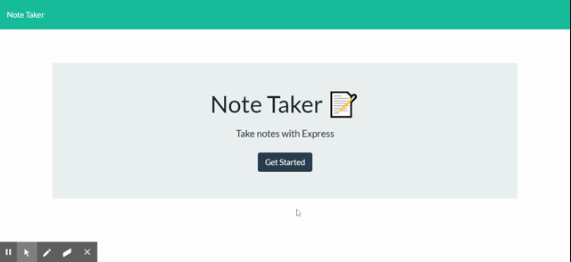

# NoteTaker
Let's Take some notes!

## Description 

This project is focused around building a server and using a json file as a sort of database. This was built using some base starter code for the front end developed by the bootcamp, and it was simply required for us to build the backend server, database, and api calls. This project was then deployed to Heroku to keep it available for testing to the masses. 

## Installation

You can download this repo at https://github.com/DaronSchmit/NoteTaker then run `npm install` to download dependencies. Then find the server file by going into Develop/Server folders and running either `node server.js` or `nodemon server.js` depending on what you have installed. The server defaults to port 8080, so go to 'localhost:8080' to see it deployed.

Additionally, you can skip the downloading and go straight to https://hidden-ocean-39633.herokuapp.com/ to see the project deployed live.

## Usage 

Load the webpage using one of the methods mentioned above, then press the Get Started button in the center of the page. This will bring you to the note taking and display page. You can click into each text field to edit it, then save using the icon in the top right. NOTE: You can only save the note if there is text in both the title and text fields. You can then display previously saved notes by clicking on them and delete them by clicking the red trash can. If you would like to take a new note after viewing others, press the pencil icon in the top left.

## Credits

credit to the University of Minnesota coding bootcamp for the starting files. The source is in a private gitlab, so I cannot share it. 
special thanks to Charlie, the instructor, as well as Jake, Paul, and the other TAs for answering so many questions. Thank you to materialize for the css framework, I hope I learn to use it better in the future.

## License

MIT License

Copyright (c) 2020 Daron Schmit

Permission is hereby granted, free of charge, to any person obtaining a copy
of this software and associated documentation files (the "Software"), to deal
in the Software without restriction, including without limitation the rights
to use, copy, modify, merge, publish, distribute, sublicense, and/or sell
copies of the Software, and to permit persons to whom the Software is
furnished to do so, subject to the following conditions:

The above copyright notice and this permission notice shall be included in all
copies or substantial portions of the Software.

THE SOFTWARE IS PROVIDED "AS IS", WITHOUT WARRANTY OF ANY KIND, EXPRESS OR
IMPLIED, INCLUDING BUT NOT LIMITED TO THE WARRANTIES OF MERCHANTABILITY,
FITNESS FOR A PARTICULAR PURPOSE AND NONINFRINGEMENT. IN NO EVENT SHALL THE
AUTHORS OR COPYRIGHT HOLDERS BE LIABLE FOR ANY CLAIM, DAMAGES OR OTHER
LIABILITY, WHETHER IN AN ACTION OF CONTRACT, TORT OR OTHERWISE, ARISING FROM,
OUT OF OR IN CONNECTION WITH THE SOFTWARE OR THE USE OR OTHER DEALINGS IN THE
SOFTWARE.

